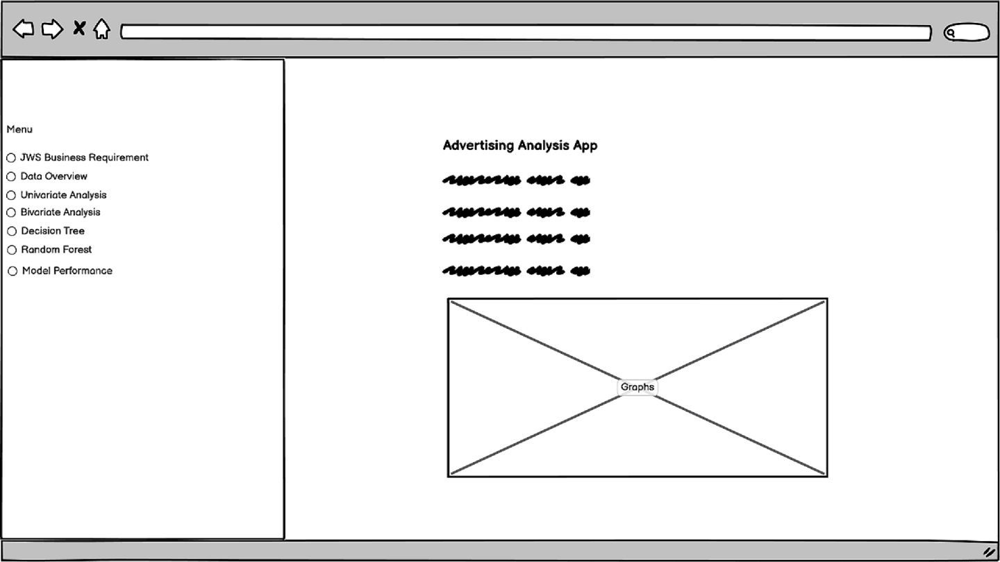
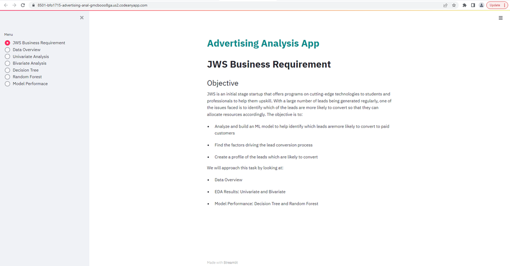
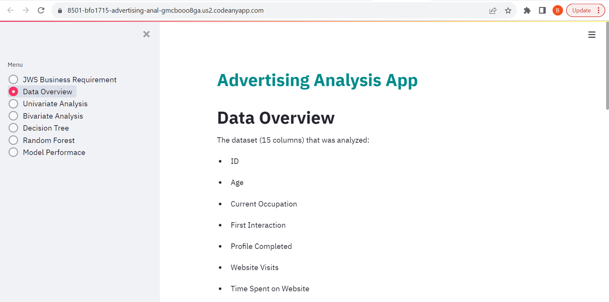
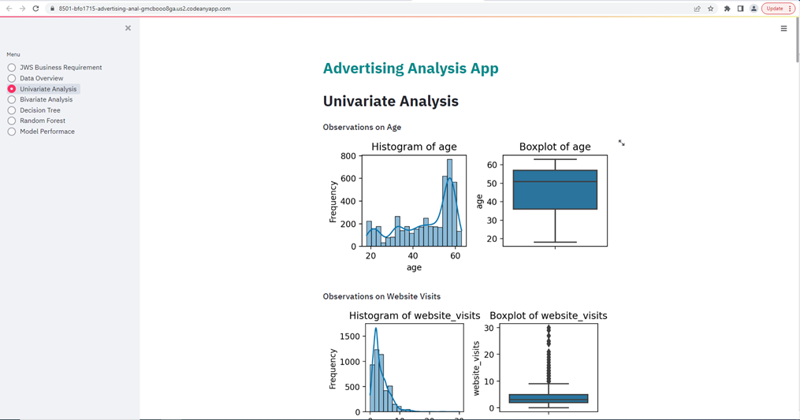
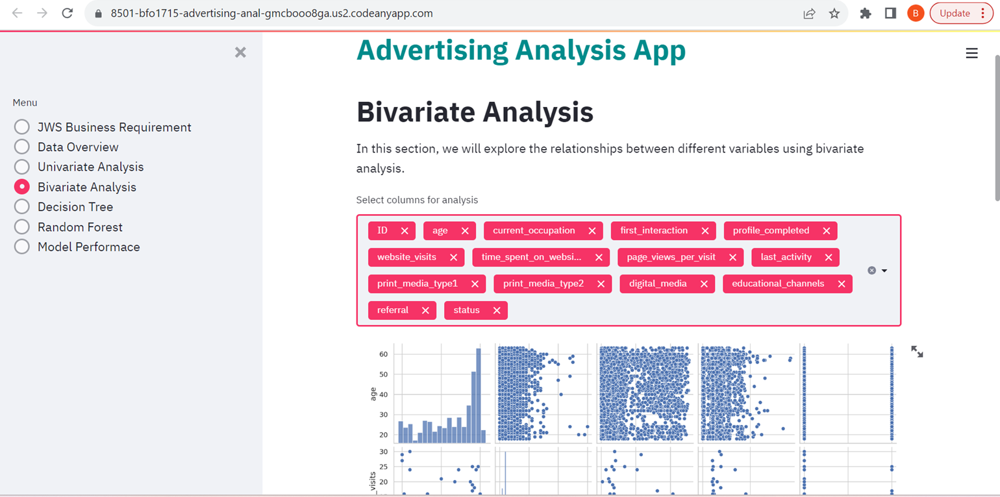
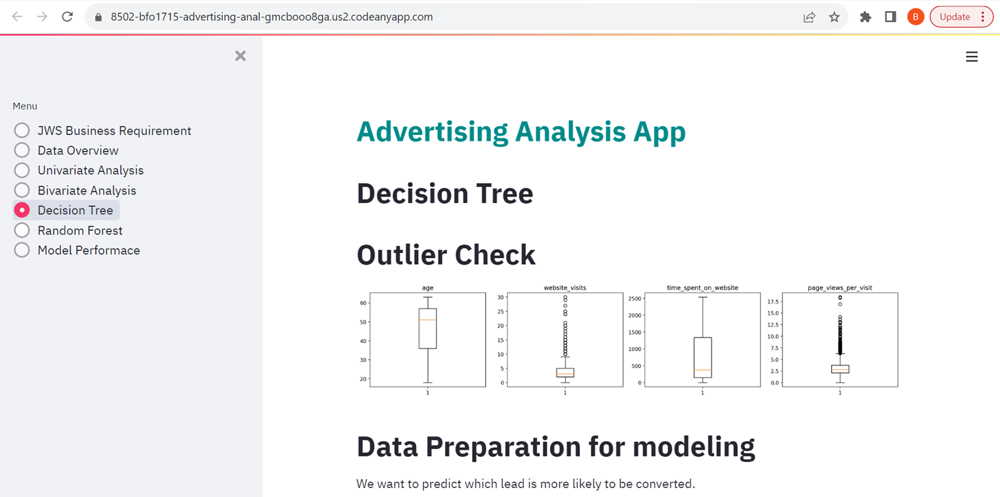
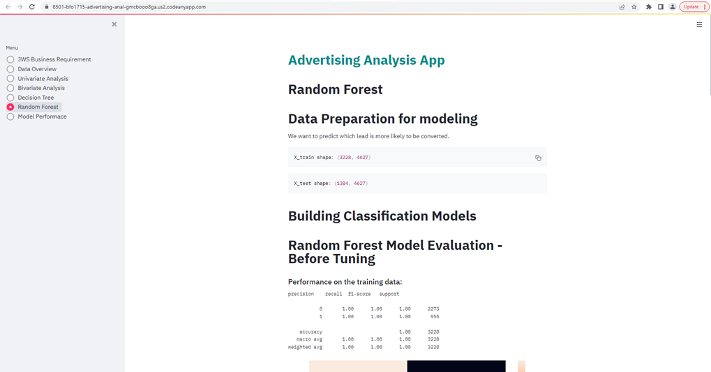
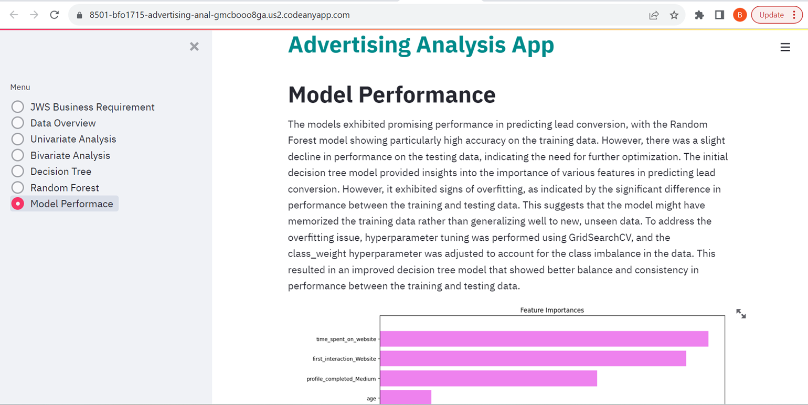

# JWS Advertising Analysis App

## Business Requirements

JWS is an emerging startup in its initial stages, specializing in
providing comprehensive programs focused on cutting-edge technologies.
These programs facilitate upskilling for students and professionals.

**Challenge**

The company aims to efficiently identify high-potential leads from
the generated leads, crucial for effective resource allocation.

**Objectives**

- **Develop an ML Model:** Create a model to predict leads likely
to convert into paying customers accurately.

- **Understand Conversion Factors:** Gain insights into critical
factors influencing lead conversion for informed decisions.

- **Create Lead Profiles:** Generate detailed profiles of leads
with higher potential to tailor effective engagement strategies.

**Approach**

- **Data Overview:** Analyze available data comprehensively to
understand its nature and structure.

- **Exploratory Data Analysis (EDA):** Uncover patterns, correlations,
and insights through univariate and bivariate analysis.

- **Model Evaluation:** Assess Decision Tree and Random Forest models
to predict lead conversions effectively.

JWS seeks to enhance lead management, optimize resource allocation,
and improve lead conversion rates through this approach.

## Data Content

The dataset (15 columns) that was analyzed:

<ul>
    <li>ID</li>
    <li>Age</li>
    <li>Current Occupation</li>
    <li>First Interaction</li>
    <li>Profile Completed</li>
    <li>Website Visits</li>
    <li>Time Spent on Website</li>
    <li>Page Views per Visit</li>
    <li>Last Activity</li>
    <li>Print Media Type1 - Ads in Newspapers</li>
    <li>Print Media Type2 - Ads in Magazines</li>
    <li>Digital Media - Ads online</li>
    <li>Educational Channels - Ads on forums, threads, newsletters</li>
    <li>Referral - referred to JWS or not</li>
    <li>Status - converted to a paid customer or not</li>
</ul>

The dataset contains information on 4,612 records with 0 duplicates.

## ML Business Case

Firstly, we will look at EDA (Exploratory Data Analysis) focusing on the statistical summary of the data, univariate and bivariate analysis:

1. Data Understanding: EDA helps you gain a deeper understanding of your dataset. By examining the statistical summary, you can quickly identify key features like means, medians, and standard deviations, which provide insights into the central tendency and spread of your data.

2. Data Quality: EDA allows us to identify data quality issues such as missing values, outliers, and inconsistencies. This is crucial for making informed decisions on data preprocessing and cleaning.

3. Feature Selection: Through univariate analysis, we can assess the distribution of individual variables. This helps in identifying which features might have low variability or are constant, which might not contribute much to your analysis and can be considered for removal.

4. Identifying Patterns: Bivariate analysis enablesus to understand the relationships between pairs of variables. This can reveal patterns, correlations, and dependencies that might not be obvious initially.

5. Feature Engineering: EDA can inspire feature engineering ideas. We might discover that combining certain variables or creating new features based on existing ones could lead to better predictive performance.

6. Assumptions Testing: Before applying more complex models, it's important to check assumptions. EDA can help you validate assumptions like normality, linearity, and homoscedasticity, which are often required by statistical techniques.

7. Outlier Detection: Outliers can significantly impact your analysis and modeling. EDA can help you identify these outliers, understand their potential causes, and decide whether to treat or remove them.

8. Data Visualization: EDA often involves creating visualizations that provide a more intuitive understanding of your data's characteristics. Visualizations can reveal trends, clusters, and anomalies that might not be apparent from numerical summaries alone.

9. Hypothesis Generation: EDA can spark hypotheses for further investigation. Patterns and relationships you discover might prompt you to ask specific questions about your data, leading to deeper analysis.

10. Communication: EDA is essential for effective communication of your findings to stakeholders. Visualizations and insights obtained from EDA can help convey complex information in an understandable manner.

11. Model Selection: Insights gained from EDA can guide your choice of modeling techniques. If you find strong relationships between variables, certain models might be more appropriate than others.

The we looked at models specifically, decision tree and random forest and evaluated the models' performance:

1. Performance Comparison: By evaluating the performance of different models, you can compare how well they are able to capture patterns and make accurate predictions on your dataset. This allows you to determine which model is more suitable for your specific problem.

2. Prediction Accuracy: Performance evaluation helps you understand how well your models are making predictions. High accuracy indicates that the model is effectively learning from the data and making informed decisions.

3. Overfitting and Underfitting Detection: Analyzing model performance can reveal whether your models are overfitting (fitting the training data too closely) or underfitting (failing to capture the underlying patterns). This insight guides you in selecting an appropriate level of model complexity.

4. Generalization Capability: Model evaluation provides insights into how well your models will perform on unseen data. A model that performs well on the training data but poorly on new data might not generalize effectively. Evaluating models on validation or test sets helps assess generalization.

5. Feature Importance: Decision trees and random forests provide feature importance scores. Analyzing these scores can help you understand which features contribute the most to the model's predictions. This can guide feature selection and inform your understanding of the problem.

6. Tuning Hyperparameters: Model evaluation helps in fine-tuning hyperparameters. You can experiment with different parameter settings and observe their impact on performance, aiming to find the best configuration for your models.

7. Business Impact: Model performance directly affects the business outcomes they support. For instance, in a marketing campaign, a model's ability to accurately identify potential customers can impact conversion rates and revenue.

8. Interpretability: Decision trees and random forests offer interpretability. Understanding how these models make decisions can provide insights into the factors influencing predictions, which is valuable for making informed business decisions.

9. Stakeholder Communication: Communicating the performance of models to stakeholders is crucial for decision-making. Well-performing models inspire confidence in their results and can influence strategic choices.

10. Continuous Improvement: Model evaluation is not a one-time task. It's an iterative process that allows you to continuously improve your models as you gather more data and refine your understanding of the problem.

In essence, EDA lays the foundation for a successful data analysis process. It helps you uncover important aspects of your data, detect issues, and make informed decisions about preprocessing, feature selection, and modeling strategies. Whilst looking at the performance of models, such as decision tree and random forest, helps you make informed decisions about their effectiveness, guide model selection, understand their predictive capabilities, and ultimately drive better outcomes for your data analysis objectives.

## Dashboard Design

Used Balsamic Wireframes to plan the UI and design of the Streamlit dashboard:

Individual pages are shown below:

        

## Testing and Bugs

* The code was tested via pylint with zero errors.
* There is sometimes a requirement to refresh the app to see the correct design with menu section and homepage, after researching and consulting with tutor it is due
  to a communication issue between Heroku and Streamlit so cannot be resolved by amending the code. 

## Deployment
### Heroku

- The App live link is: <https://jws-advertising-analysis-576a7866f352.herokuapp.com/>
* Set Python version to a [Heroku-20] stack currently supported version.
* The project was deployed to Heroku using the following steps.

1. Log in to Heroku and create an App
2. At the Deploy tab, select GitHub as the deployment method.
3. Select your repository name and click Search. Once it is found, click Connect.
4. Select the branch you want to deploy, then click Deploy Branch.
5. The deployment process should happen smoothly if all deployment files are fully functional. Click the button Open App on the top of the page to access your App.

## Main Data Analysis and Machine Learning Libraries

The libraries used below were used for data manipulation, visualization, and machine learning, data science and analysis tasks:

1. streamlit: Streamlit is a Python library used to create interactive web applications for data science and machine learning projects. It simplifies the process of turning data scripts into shareable web apps.

2. pandas: Pandas is a powerful data manipulation and analysis library. It provides data structures like DataFrame for efficiently storing and manipulating large datasets.

3. numpy: NumPy is a fundamental package for numerical computations in Python. It provides support for arrays, matrices, and various mathematical functions.

4. matplotlib: Matplotlib is a widely used plotting library in Python. It provides a flexible way to create static, animated, and interactive visualizations.

5. seaborn: Seaborn is a statistical data visualization library based on Matplotlib. It provides a high-level interface for creating informative and attractive statistical graphics.

6. sklearn (scikit-learn): Scikit-learn is a machine learning library for Python. It provides simple and efficient tools for data mining and data analysis. In the provided code, it's used for building machine learning models.

7. DecisionTreeClassifier: A class from scikit-learn used to create a decision tree classifier, a type of supervised learning algorithm for classification tasks.

8. RandomForestClassifier: Another class from scikit-learn used to create a random forest classifier, an ensemble learning method that builds multiple decision trees to improve classification accuracy.

9. classification_report: A function from scikit-learn used to generate a text report showing the main classification metrics for a model's performance.

10. confusion_matrix: A function from scikit-learn used to create a confusion matrix, which helps assess the performance of a classification model.

11. recall_score: A function from scikit-learn used to calculate the recall (sensitivity) score, a metric that measures the model's ability to identify positive instances correctly.

12. make_scorer: A function from scikit-learn used to create a scoring function that can be customized for model evaluation in cross-validation or grid search.

13. GridSearchCV: A class from scikit-learn used for hyperparameter tuning using an exhaustive search over a specified parameter grid.

## Credits 

Code Institute - <https://codeinstitute.net/>
Stack Overflow - <https://stackoverflow.com/>
